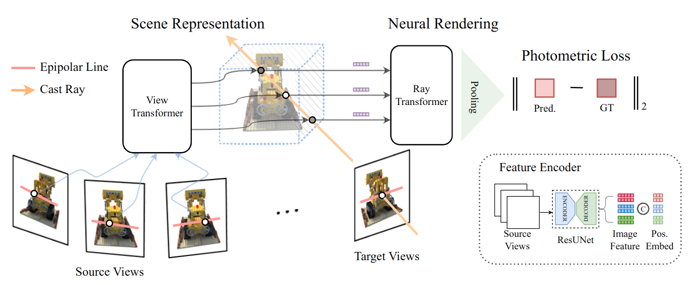

# Is Attention All That NeRF Needs?
[Mukund Varma T](https://mukundvarmat.github.io/)<sup>1*</sup>,
[Peihao Wang](https://peihaowang.github.io/)<sup>2*</sup>,
[Xuxi Chen](https://xxchen.site/)<sup>2</sup>,
[Tianlong Chen](https://tianlong-chen.github.io/)<sup>2</sup>,
[Subhashini Venugopalan](https://vsubhashini.github.io/)<sup>3</sup>,
[Zhangyang Wang](https://vita-group.github.io/)<sup>2</sup>

<sup>1</sup>Indian Institute of Technology Madras, <sup>2</sup>University of Texas at Austin, <sup>3</sup>Google Research

<sup>*</sup> denotes equal contribution.

[Project Page](https://vita-group.github.io/GNT) | [Paper](https://arxiv.org/abs/2207.13298)

This repository is built based on IBRNet's [offical repository](https://github.com/googleinterns/IBRNet)

<ul>
  <li><span style="color: red">News!</span> GNT is accepted at ICLR 2023 🎉. Our updated cross-scene trained <a href="https://github.com/VITA-Group/GNT#pre-trained-models">checkpoint</a> should generalize to complex scenes, and even achieve comparable results to SOTA per-scene optimized methods without further tuning!</li>
  <li><span style="color: red">News!</span> Our work was presented by Prof. Atlas in his <a href="https://mit.zoom.us/rec/play/O-E4BZQZLc4km4Xd9EFXrMleMBPVoxK73HzZwo7iEmndSZb--QJXHoo4apFKWT_VEA09TQSO7p6CkIuw.q0ReKAVz5tfsS2Ye?continueMode=true&_x_zm_rtaid=GwwbZYSBSbqSZaZ-b10Qqw.1666125821172.50b38719911eea3b66d299aac233d421&_x_zm_rhtaid=94">talk</a> at the <a href="https://sites.google.com/view/visionseminar">MIT Vision and Graphics Seminar</a> on 10/17/22.</li>
</ul>

## Introduction

We present <i>Generalizable NeRF Transformer</i> (<b>GNT</b>), a pure, unified transformer-based architecture that efficiently reconstructs Neural Radiance Fields (NeRFs) on the fly from source views.
Unlike prior works on NeRF that optimize a <i>per-scene</i> implicit representation by inverting a handcrafted rendering equation, GNT achieves <i>generalizable</i> neural scene representation and rendering, by encapsulating two transformers-based stages.
The first stage of GNT, called <i>view transformer</i>, leverages multi-view geometry as an inductive bias for attention-based scene representation, and predicts coordinate-aligned features by aggregating information from epipolar lines on the neighboring views.
The second stage of GNT, named <i>ray transformer</i>, renders novel views by ray marching and directly decodes the sequence of sampled point features using the attention mechanism.
Our experiments demonstrate that when optimized on a single scene, GNT can successfully reconstruct NeRF without explicit rendering formula, and even improve the PSNR by ~1.3 dB&uarr; on complex scenes due to the learnable ray renderer.
When trained across various scenes, GNT consistently achieves the state-of-the-art performance when transferring to forward-facing LLFF dataset (LPIPS ~20%&darr;, SSIM ~25%&uarr;) and synthetic blender dataset (LPIPS ~20%&darr;, SSIM ~4%&uarr;).
In addition, we show that depth and occlusion can be inferred from the learned attention maps, which implies that <i>the pure attention mechanism is capable of learning a physically-grounded rendering process</i>.
All these results bring us one step closer to the tantalizing hope of utilizing transformers as the ``universal modeling tool'' even for graphics.



## Installation

Clone this repository:

```bash
git clone https://github.com/MukundVarmaT/GNT.git
cd GNT/
```

The code is tested with python 3.8, cuda == 11.1, pytorch == 1.10.1. Additionally dependencies include: 

```bash
torchvision
ConfigArgParse
imageio
matplotlib
numpy
opencv_contrib_python
Pillow
scipy
imageio-ffmpeg
lpips
scikit-image
```

## Datasets

We reuse the training, evaluation datasets from [IBRNet](https://github.com/googleinterns/IBRNet). All datasets must be downloaded to a directory `data/` within the project folder and must follow the below organization. 
```bash
├──data/
    ├──ibrnet_collected_1/
    ├──ibrnet_collected_2/
    ├──real_iconic_noface/
    ├──spaces_dataset/
    ├──RealEstate10K-subset/
    ├──google_scanned_objects/
    ├──nerf_synthetic/
    ├──nerf_llff_data/
```
We refer to [IBRNet's](https://github.com/googleinterns/IBRNet) repository to download and prepare data. For ease, we consolidate the instructions below:
```bash
mkdir data
cd data/

# IBRNet captures
gdown https://drive.google.com/uc?id=1rkzl3ecL3H0Xxf5WTyc2Swv30RIyr1R_
unzip ibrnet_collected.zip

# LLFF
gdown https://drive.google.com/uc?id=1ThgjloNt58ZdnEuiCeRf9tATJ-HI0b01
unzip real_iconic_noface.zip

## [IMPORTANT] remove scenes that appear in the test set
cd real_iconic_noface/
rm -rf data2_fernvlsb data2_hugetrike data2_trexsanta data3_orchid data5_leafscene data5_lotr data5_redflower
cd ../

# Spaces dataset
git clone https://github.com/augmentedperception/spaces_dataset

# RealEstate 10k
## make sure to install ffmpeg - sudo apt-get install ffmpeg
git clone https://github.com/qianqianwang68/RealEstate10K_Downloader
cd RealEstate10K_Downloader
python3 generate_dataset.py train
cd ../

# Google Scanned Objects
gdown https://drive.google.com/uc?id=1w1Cs0yztH6kE3JIz7mdggvPGCwIKkVi2
unzip google_scanned_objects_renderings.zip

# Blender dataset
gdown https://drive.google.com/uc?id=18JxhpWD-4ZmuFKLzKlAw-w5PpzZxXOcG
unzip nerf_synthetic.zip

# LLFF dataset (eval)
gdown https://drive.google.com/uc?id=16VnMcF1KJYxN9QId6TClMsZRahHNMW5g
unzip nerf_llff_data.zip
```

## Usage

### Training

```bash
# single scene
# python3 train.py --config <config> --train_scenes <scene> --eval_scenes <scene> --optional[other kwargs]. Example:
python3 train.py --config configs/gnt_blender.txt --train_scenes drums --eval_scenes drums
python3 train.py --config configs/gnt_llff.txt --train_scenes orchids --eval_scenes orchids

# cross scene
# python3 train.py --config <config> --optional[other kwargs]. Example:
python3 train.py --config configs/gnt_full.txt 
```

To decode coarse-fine outputs set `--N_importance > 0`, and with a separate fine network use `--single_net = False`

### Pre-trained Models

<table>
  <tr>
    <th>Dataset</th>
    <th>Scene</th>
    <th colspan=2>Download</th>
  </tr>
  <tr>
    <th rowspan=8>LLFF</th>
    <td>fern</td>
    <td><a href="https://drive.google.com/file/d/15rpT4iUb21JL-IwQxpzNhdu84HByJusP/view?usp=drive_link">ckpt</a></td>
    <td><a href="https://drive.google.com/drive/folders/1y3eHIHgVsT9NIRZ0KhSYT7xhhu6ded9Z?usp=drive_link">renders</a></td>
  </tr>
  <tr>
    <td>flower</td>
    <td><a href="https://drive.google.com/file/d/11A-L6rRpf4rLyYK296rm9LpaXc57zkx1/view?usp=drive_link">ckpt</a></td>
    <td><a href="https://drive.google.com/drive/folders/1bSwJlIo_ntYlYQ4jno9ZgciQeNI3olZk?usp=drive_link">renders</a></td>
  </tr>
  <tr>
    <td>fortress</td>
    <td><a href="https://drive.google.com/file/d/1WnCpevgpEmWKLYxcgg8emNK9uU_jFzS8/view?usp=drive_link">ckpt</a></td>
    <td><a href="https://drive.google.com/drive/folders/1GzQ71O-Mh81ckut-S8RqwRuSuEbR7uYE?usp=drive_link">renders</a></td>
  </tr>
  <tr>
    <td>horns</td>
    <td><a href="https://drive.google.com/file/d/1Zq4sKLLUgiO74FxqLLW1-PT1ycB-byzG/view?usp=drive_link">ckpt</a></td>
    <td><a href="https://drive.google.com/drive/folders/1SRpybO5aFkmB50spFjAzgU_WpTfngtZC?usp=drive_link">renders</a></td>
  </tr>
  <tr>
    <td>leaves</td>
    <td><a href="https://drive.google.com/file/d/1bBR7Rg-Dx3lfZxEHjkHExjPH4jjdfVzM/view?usp=drive_link">ckpt</a></td>
    <td><a href="https://drive.google.com/drive/folders/1ZZGDvdvH12rpFgXroJ0yuxxTrQAqLpwa?usp=drive_link">renders</a></td>
  </tr>
  <tr>
    <td>orchids</td>
    <td><a href="https://drive.google.com/file/d/1976YpBEdHpWpcdtAmSzlCfSku91FyX5O/view?usp=drive_link">ckpt</a></td>
    <td><a href="https://drive.google.com/drive/folders/1FyZZcOicxdOv6pUHdOuJShW2kOxlpmxv?usp=drive_link">renders</a></td>
  </tr>
  <tr>
    <td>room</td>
    <td><a href="https://drive.google.com/file/d/1WwjchNCtYfF8iNnoxyprvOEI9Ziivgxl/view?usp=drive_link">ckpt</a></td>
    <td><a href="https://drive.google.com/drive/folders/1nKE4q52jMwyekI7LJN1e0t0mLUZDEHWY?usp=drive_link">renders</a></td>
  </tr>
  <tr>
    <td>trex</td>
    <td><a href="https://drive.google.com/file/d/11ArQm9Wf6mYBLQor9t8Bh8LEGYwCXgXM/view?usp=drive_link">ckpt</a></td>
    <td><a href="https://drive.google.com/drive/folders/1SKhH_SPMH6KFLw0YEHUiofCPp5pAYR8y?usp=drive_link">renders</a></td>
  </tr>
  <tr>
    <th rowspan=8>Synthetic</th>
    <td>chair</td>
    <td><a href="https://drive.google.com/file/d/1MD8I2lIKIsYD0FlYZqT_0bGz5ykHOH3A/view?usp=drive_link">ckpt</a></td>
    <td><a href="https://drive.google.com/drive/folders/1xpfz6vZ-8a3rlL62dMbKifGtiHk34va_?usp=drive_link">renders</a></td>
  </tr>
  <tr>
    <td>drums</td>
    <td><a href="https://drive.google.com/file/d/1pS0iVrfqaSSO03qg4n4R9_IIXBV6ebGC/view?usp=drive_link">ckpt</a></td>
    <td><a href="https://drive.google.com/drive/folders/1yON62piFrfpd-mMdzhkB7YlhvsEF4W2B?usp=drive_link">renders</a></td>
  </tr>
  <tr>
    <td>ficus</td>
    <td><a href="https://drive.google.com/file/d/1cBNWd6UlpkyHAG7K0CbBu5LKR8sxulDr/view?usp=drive_link">ckpt</a></td>
    <td><a href="https://drive.google.com/drive/folders/1ip98zv_wMLs1e3EhTMj_ZTCtVKxtfNnZ?usp=drive_link">renders</a></td>
  </tr>
  <tr>
    <td>hotdog</td>
    <td><a href="https://drive.google.com/file/d/1TXd-CkYXC-thULyKqbIk2ADrZfYZwISt/view?usp=drive_link">ckpt</a></td>
    <td><a href="https://drive.google.com/drive/folders/1REoU08rwN3Yf6y3-4WpsOiqbZZjX3qq4?usp=drive_link">renders</a></td>
  </tr>
  <tr>
    <td>lego</td>
    <td><a href="https://drive.google.com/file/d/1z2-sAhKskShU3UiQ3zC2ih8lfyvG5Qx-/view?usp=drive_link">ckpt</a></td>
    <td><a href="https://drive.google.com/drive/folders/13_OHY1V_1E-PxiJ1fduCjNauEMe-bzGf?usp=drive_link">renders</a></td>
  </tr>
  <tr>
    <td>materials</td>
    <td><a href="https://drive.google.com/file/d/1kD_aLM8Jy1mzQ-4KYbHieRIiwuYwNH3P/view?usp=drive_link">ckpt</a></td>
    <td><a href="https://drive.google.com/drive/folders/1818ONEF-m2J2pVPhhT5E7EffFW7yqZcZ?usp=drive_link">renders</a></td>
  </tr>
  <tr>
    <td>mic</td>
    <td><a href="https://drive.google.com/file/d/1d6ua5e1zWVsXQ1byVDEyyUWd0vov0gSN/view?usp=drive_link">ckpt</a></td>
    <td><a href="https://drive.google.com/drive/folders/1a59vpXVkeSLLW-vVyVbLst2fQ53xE5Qv?usp=drive_link">renders</a></td>
  </tr>
  <tr>
    <td>ship</td>
    <td><a href="https://drive.google.com/file/d/187xCdD35dbfUxBYOQP4WYIQshuheU-z4/view?usp=drive_link">ckpt</a></td>
    <td><a href="https://drive.google.com/drive/folders/1SaGxhMhlx2aZVrYGaXG9CxDT9J7ZMcnS?usp=drive_link">renders</a></td>
  </tr>
  <tr>
    <td>generalization</td>
    <td>N.A.</td>
    <td><a href="https://drive.google.com/file/d/1YvOJXa5eGpKgoMYcxC2ma7prB1n5UwRn/view?usp=drive_link">ckpt</a></td>
    <td><a href="https://drive.google.com/drive/folders/1v8AGaldveu04XTVKBKXEgFBxFHbaznto?usp=drive_link">renders</a></td>
  </tr>
</table>

To reuse pretrained models, download the required checkpoints and place in appropriate directory with name - `gnt_<scene-name>` (single scene) or `gnt_<full>` (generalization). Then proceed to evaluation / rendering. To facilitate future research, we also provide half resolution renderings of our method on several benchmark scenes. Incase there are issues with any of the above checkpoints, please feel free to open an issue. 

### Evaluation

```bash
# single scene
# python3 eval.py --config <config> --eval_scenes <scene> --expname <out-dir> --run_val --optional[other kwargs]. Example:
python3 eval.py --config configs/gnt_llff.txt --eval_scenes orchids --expname gnt_orchids --chunk_size 500 --run_val --N_samples 192
python3 eval.py --config configs/gnt_blender.txt --eval_scenes drums --expname gnt_drums --chunk_size 500 --run_val --N_samples 192

# cross scene
# python3 eval.py --config <config> --expname <out-dir> --run_val --optional[other kwargs]. Example:
python3 eval.py --config configs/gnt_full.txt --expname gnt_full --chunk_size 500 --run_val --N_samples 192
```

### Rendering

To render videos of smooth camera paths for the real forward-facing scenes.

```bash
# python3 render.py --config <config> --eval_dataset llff_render --eval_scenes <scene> --expname <out-dir> --optional[other kwargs]. Example:
python3 render.py --config configs/gnt_llff.txt --eval_dataset llff_render --eval_scenes orchids --expname gnt_orchids --chunk_size 500 --N_samples 192
```

The code has been recently tidied up for release and could perhaps contain tiny bugs. Please feel free to open an issue.


## Cite this work

If you find our work / code implementation useful for your own research, please cite our paper.

```
@inproceedings{
    t2023is,
    title={Is Attention All That Ne{RF} Needs?},
    author={Mukund Varma T and Peihao Wang and Xuxi Chen and Tianlong Chen and Subhashini Venugopalan and Zhangyang Wang},
    booktitle={The Eleventh International Conference on Learning Representations },
    year={2023},
    url={https://openreview.net/forum?id=xE-LtsE-xx}
}
```
